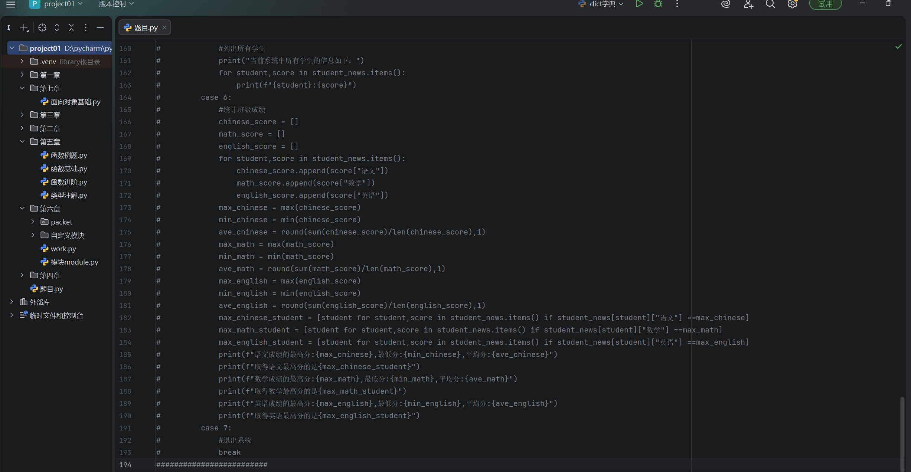
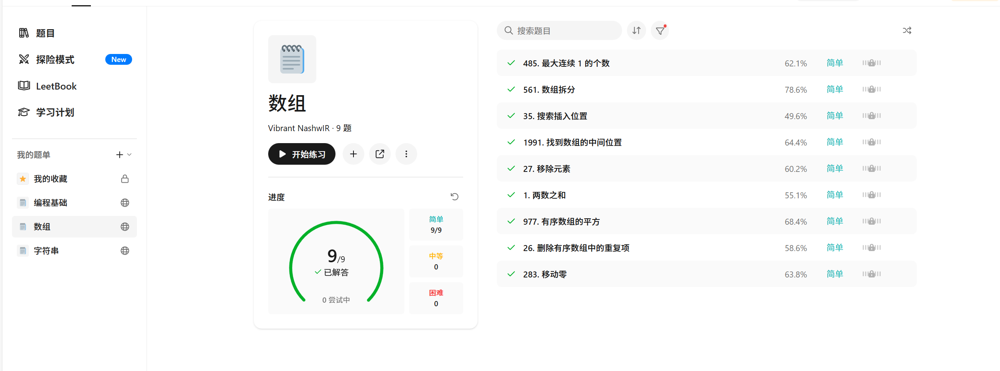
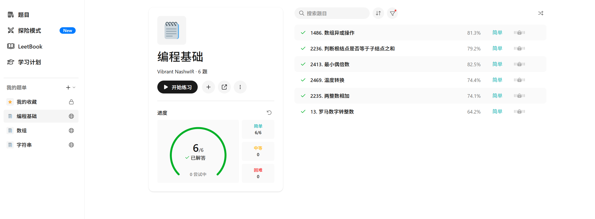
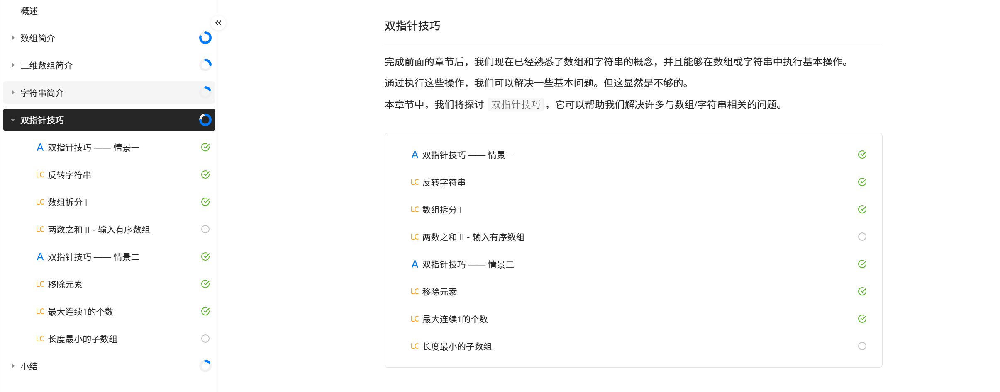
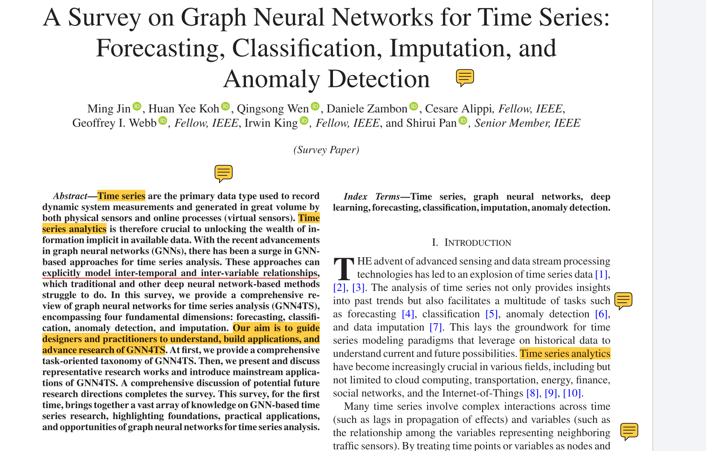

# 周报5.28

1.主要学习了python的函数、模块、面向对象的学习（已经学完了黑马程序员的核心语法部分）

2.巩固了上周学的数据容器的内容，并在leetcode上刷题（主要是刷数组的题）

3.完成了点云语义分割的论文学习，并且重新精读了一遍VGGT论文，剩下的论文还在阅读中

下周计划：继续巩固python已经学过的内容，然后leetcode上接着刷题，阅读剩下几篇论文

# python学习

# leetcode刷题

目前刚开始刷leetcode，可能算法基础比较差，所以暂时刷的比较慢

# 论文学习

 [VGGT阅读笔记.pdf](VGGT阅读笔记.pdf) 

 [点云语义分割阅读笔记.pdf](点云语义分割阅读笔记.pdf) 

目前还在阅读当中的论文：

