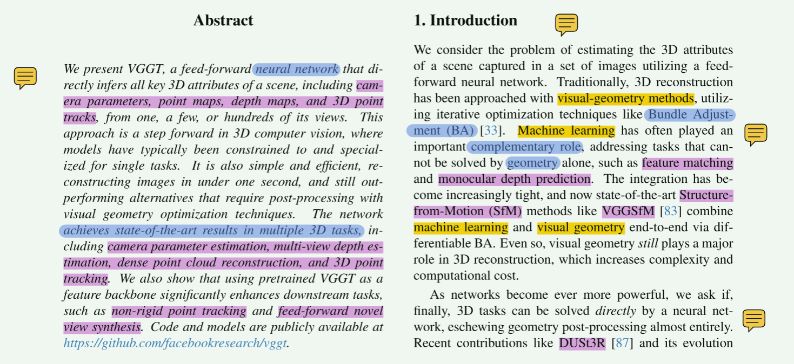
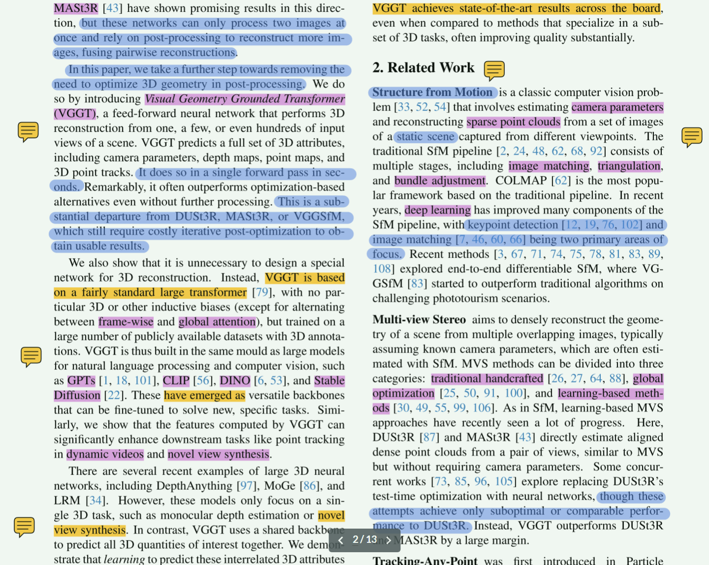

# 6.11周报

## leetcode刷题

这周把leetcode之前刷的题目又重新刷了一遍，现在已经基本把数组、字符串、哈希表部分的题目做熟练了，然后下周准备开始做链表、栈和队列的题目

## 深度学习

目前想先花一周多的时间去把《深度学习入门：基于Python的理论与实现》这本书先读一遍，先基本了解下深度学习的基础知识，然后再去学小土堆的pytorch。现在已经读了一部分了

## 文献阅读

这周从头精读了一遍VGGT，明天打算再花一天时间好好整理下思路，然后准备看下一篇文献

