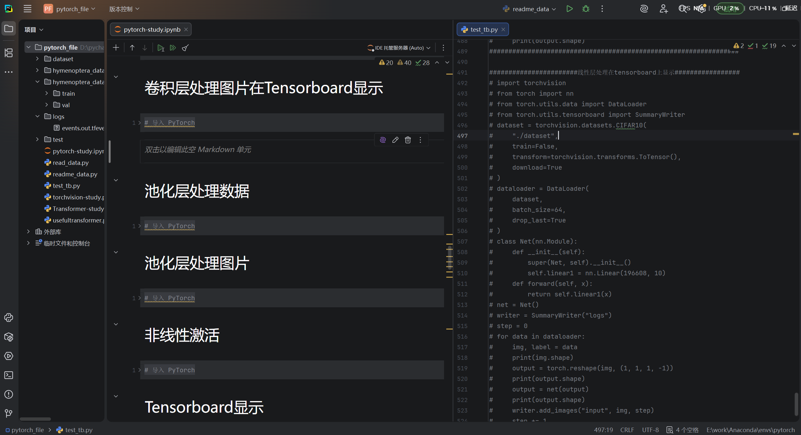

# 6.25周报

## 本周学习：

### 1.深度学习:

本周成功读完了《深度学习入门：基于Python的理论与实现》，对于一些重要概念，比如神经网络的架构、激活函数、损失函数、卷积、池化等概念有了了解，并且去学了小土堆的pytorch入门教程（目前快学完了），跟着课程在pycharm上面敲了代码，现在已经基本掌握了一些代码的编写，比如dataset和dataloader的使用，tensorboard可以用来查看图片，如何搭建卷积层、池化层等。

### 2.论文阅读：

本周读完了点云分割的论文，并且已经做好了ppt，准备后续汇报

### 3.leetcode刷题：

leetcode这周没刷多少题，大部分时间都花在深度学习和论文上了

## 下周计划：

1.结束小土堆的课程，然后打算去花点时间看下李沐的《动手学深度学习》Pytorch版，去补充点基础知识

2.接着阅读时序综述论文

3.leetcode继续刷题