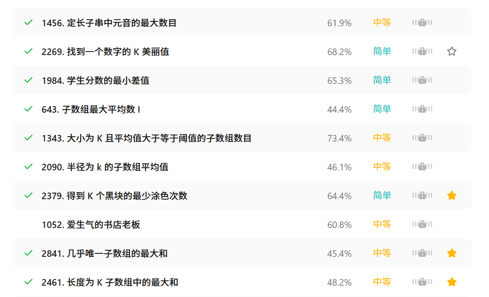
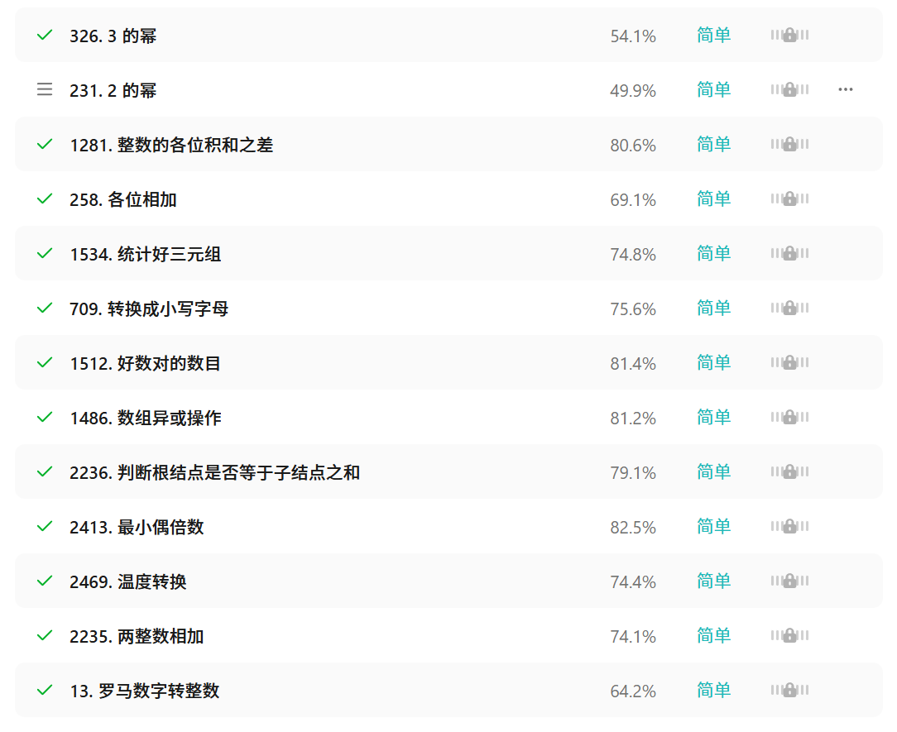

# 6.4周报

本周主要完成了剩余两篇论文的阅读，并且继续在leetcode上刷题

下周计划：

1.逐步开始这5篇论文的第二轮精读

2.数组，字符串，哈希表的刷题结尾，准备开展链表、栈和队列的刷题

# leetcode刷题

本周刷了leetcode上入门题，以及数组的滑动窗口、哈希表等题

# 论文学习

 [条件扩散模型.pdf](条件扩散模型.pdf) 

 [图生文阅读笔记.pdf](图生文阅读笔记.pdf) 