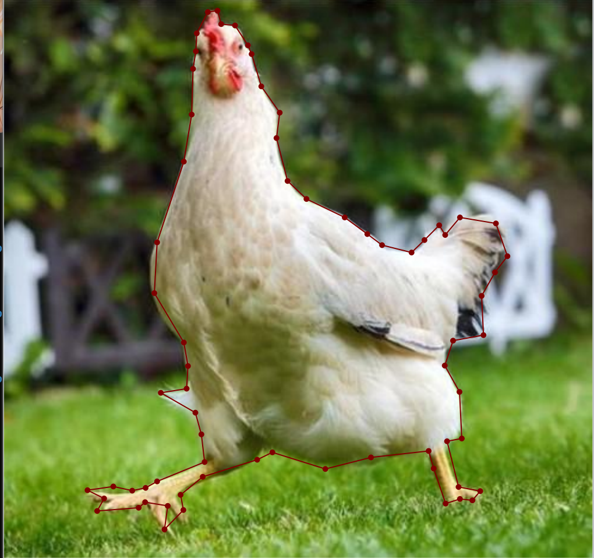

# 7.23周报

本周完成的事：

1.阅读了《基于深度学习的雷达辐射源分选方法研究》的毕业论文，然后制作了PPT，准备下周一的汇报

2.学习了 Labelme 图像标注工具的使用方法，了解了图像语义分割任务中的数据标注流程，包括多边形区域标注、标签生成以及标注文件格式等内容，可用于语义分割模型的训练使用

3.学习了 RNN 和 Transformer 模型的基本架构，了解了循环神经网络中的序列建模机制以及 Transformer 中注意力机制、编码器-解码器结构等核心内容。后面打算去跑一下相关代码