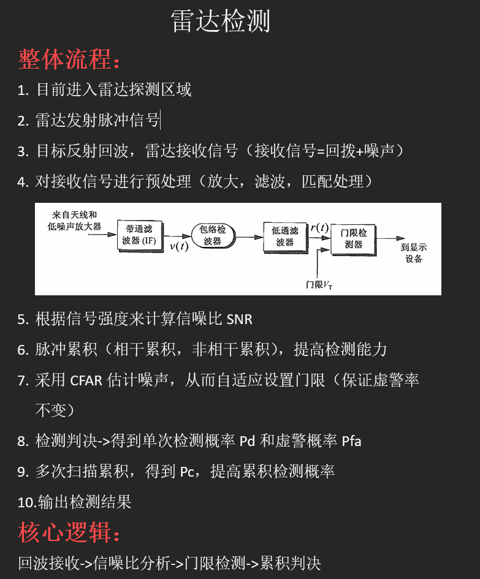

# 7.30 周报

本周完成：

1.前三天接着学RNN和Transformer了，到网上找了个别人的开源代码，然后还在研究，暂时没去跑模型

2.把这周一汇报的论文和ppt巩固了下，然后在汇报结束之后反应过来感觉自己学的有点乱，所以去请教了下师兄

3.周二到周四，去仔细读了师兄发的《雷达系统设计MATLAB仿真》这本书，目前是把雷达检测部分的流程给弄明白了，然后内部的一些细节还需要再研究研究

