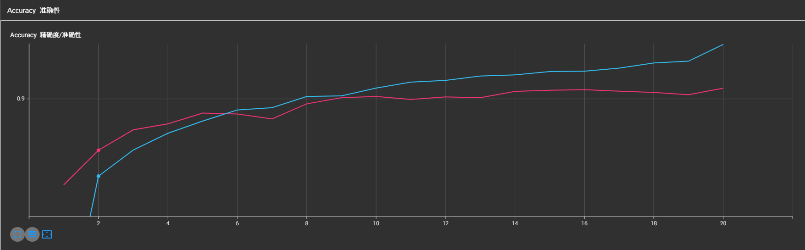
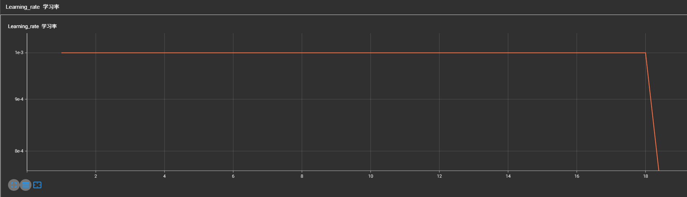
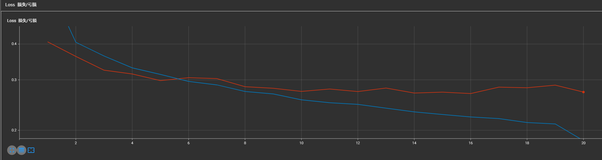
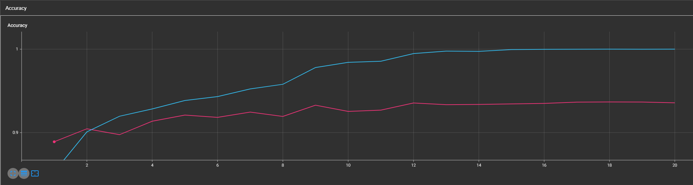
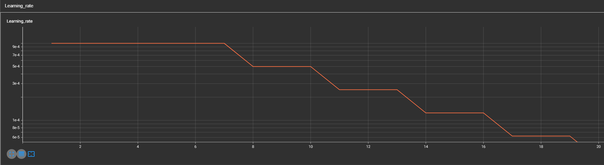
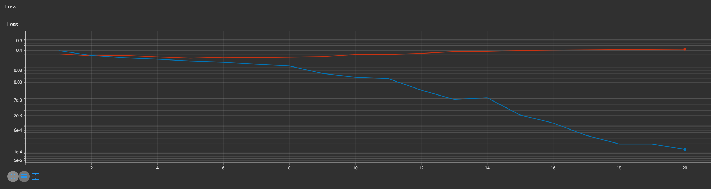

# 7.9周报

## 这周大部分时间花在了两个地方：

1.李沐深度学习课程的学习，帮助巩固前面学到的知识，并且扩充一部分不了解的，然后重新去跑了一遍LeNet、AlexNet、VGG、以及新的ResNet模型

### LeNet的训练结果（蓝色的是训练集，红色的是验证集），分别表示精度，学习率，损失

可以发现该训练结果过拟合的问题不太明显，且精度也较为合理

### ResNet的训练结果（蓝色的是训练集，红色的是验证集），分别表示精度，学习率，损失

可以发现模型的训练出现了明显的过拟合现象，在8-10轮的时候，效果比较好

## 2.重新精读了一遍条件扩散模型