# 9.17周报

## 一.论文学习

这周把上周剩下的论文给收了个尾

**训练时循环模块的运行次数如何定**

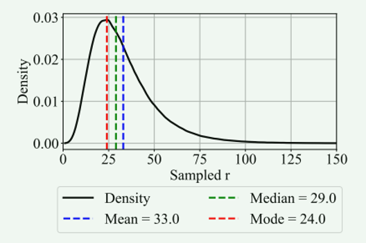

作者在论文中提及，循环次数不是固定的，而是会随机选择，而这种随机选择就是在类似图上的这种分布图来选的，我们很明显就可以看出哪部分的次数是最多的

  ，作者先生成一个服从正态分布的图，就类似图上的

  ，再根据分布图来随机生成整数循环次数

**作者训练模型时采用了哪些数据**

 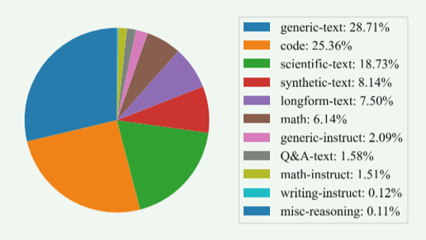

从这张图我们可以看出，通用文本、代码和科学文本占比最大

基础语言能力训练：通用文本和长文本

结构化计算能力训练：代码

科学与数学能力：科学文本和数学文本

理解用户任务的能力：指令和问答数据

但是这不能说明作者设置的这种配比最优，也不能证明如果后期模型效果好是因为本身的循环结构还是这种配比。因为作者没用去对数据做消融实验

**多GPU训练为什么会变慢**

GPU的数量增加：

梯度同步和网络通信增加

GPU之间互相等待

单张GPU有效利用率下降

**作者进行的三次试验**

前两次实验失败，第三次成功，通过三幅图我们可以了解到整个过程

 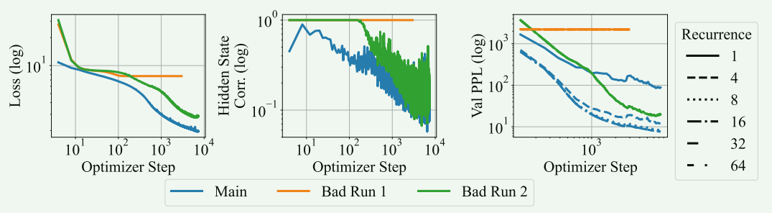

**什么是验证困惑度PPL**

PPL是衡量模型预测下一个token时有多“不确定”

PPL越小，说明模型越清楚下一个token应该是什么

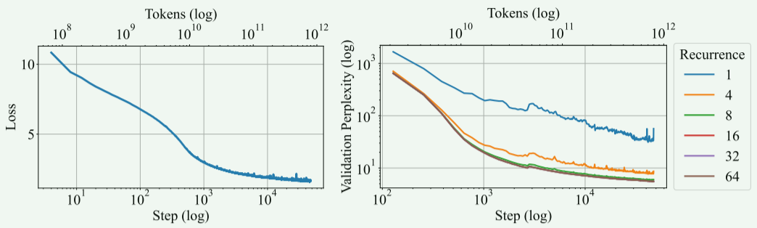

**论文成功模型Huginn-0125在约800B token预训练过程中的完整变化**

1.Loss：模型的loss是在持续下降的，证明模型是在训练过程中持续学习的，但是训练后期由于数据之间的基础规律比较难以改进，因此下降速度变缓

2.PPL：随着循环次数的增加，可以很直观的发现模型的PPL是在下降的，这证明模型准确预测下一个token的概率在逐渐增加，也说明每次循环模型都在更新潜空间的隐藏状态

##  二.雷达学习

按照周老师说的，我去跑了下多目标回波检测这部分的代码

**地面雷达与空中三目标的参数测量的仿真模拟**

雷达参数设置：
电磁波传播速度：c=3×10^8m/s
雷达载频：f_c=3 GHz
脉冲重复频率：PRF = 10 kHz
波长：λ=0.1 m
目标参数设置：
目标一：位置：[2800,-1000,500]     速度：[-30,20,0]      RCS：1 m²
目标二：位置：[4800,500,1000]    速度：[-50,-10,0]    RCS：3 m²
目标三：位置：[7000,3000,1500]   速度： [-80,30,-5]    RCS：0.5 m²
通过计算，我们可以得到各个目标相对于雷达的斜距，径向速度，方位角以及俯仰角

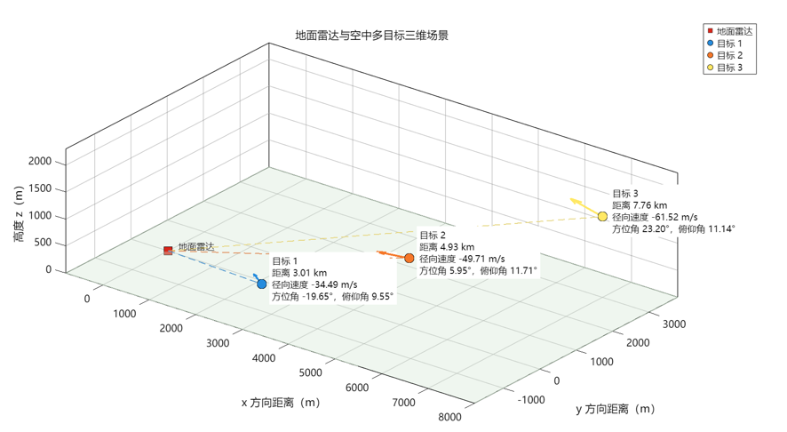

雷达发射LFM脉冲仿真生成仿真
参数设置：
LFM带宽：B=10" MHz" 
脉冲宽度：T=10 μs
快时间采样率：f_s=20" MHz" 
调频率：K=1" MHz"/μs
时间带宽积：BT=100
上图是复基带LFM信号的实部，可以发现的是由于有调频率的存在所以两端的频率较大，因此振荡相比中间部分要快
下图是LFM脉冲频谱，离散复基带信号可表示的频率范围为[-f_s/2, f_s/2)
，能量主要集中在-5" MHz"∼+5" MHz" ，这主要对应于带宽B=10" MHz"  

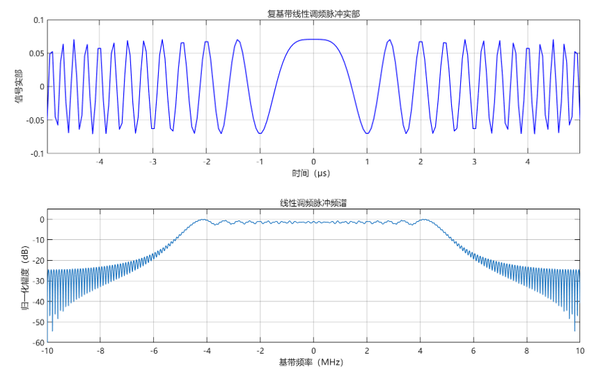

雷达接收到的回波信号（无噪声和杂波）
上面有设置雷达发射脉冲宽度为T_p=10 μs，并且由于三个目标距离雷达的距离不同，因此回波到达的时间也不同，三条虚线分别代表回波的到达时间

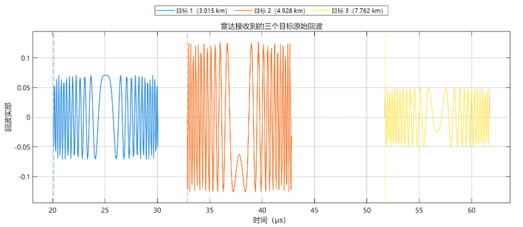

雷达接收到的回波信号（加入噪声和杂波）
在理想回波的基础之上加入了噪声和杂波，噪声的图像如右上角所示，杂波如左下角所示，可以发现的是噪声在近远距离下幅度基本固定，而杂波则是在近地处才较明显，在回波信号加上噪声和杂波之后，可以发现的是，信号基本上看不见了，因此就需要后面的匹配滤波操作了

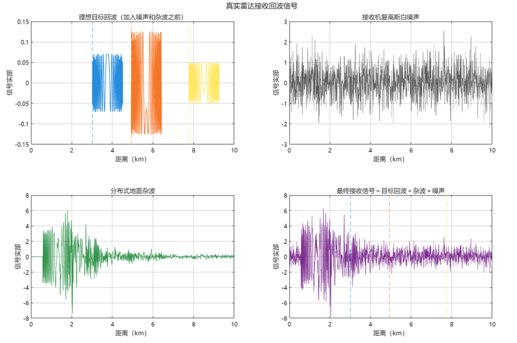

对真实接收信号进行匹配滤波后的效果
1.首先对不含噪声和杂波的回波信号进行匹配滤波，可以发现的是，产生的脉冲压缩效果很明显，信号能量被压缩到了中心位置
此时将原始波包宽度(cT_p)/2=1.5" km" 压缩成了ΔR≈c/2B=15" m" ，显著提高了距离分辨率，增强了主瓣
2.当存在噪声和杂波时，对回波信号进行匹配滤波后可以看到，目标信号依然
被噪声和杂波所淹没，看不清，这就告诉我们一个事情，就是当存在强杂波时，仅靠匹配滤波只能解决距离分辨率的问题，仍然无法把目标信号与噪声和杂波区分开来，需要采用额外的方法

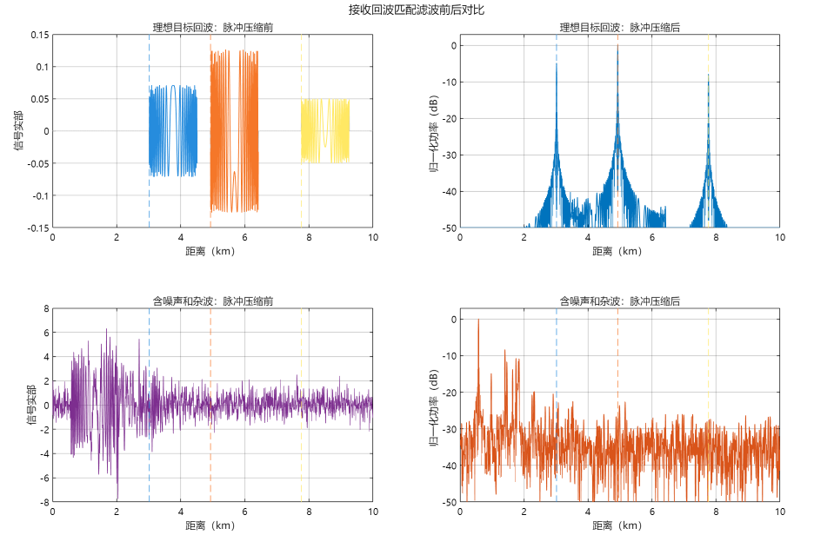

对匹配滤波后的回波进行距离-多普勒处理
首先对匹配滤波后的回波进行慢时间多普勒FFT处理，左图生成了完整距离-多普勒功率图，横轴是多普勒频率，主要反应目标的径向速度，纵轴是距离，主要反应目标距离雷达有多远，颜色代表回波功率，越黄越强，越蓝越弱
在零多普勒频率附近可以观察到明显的亮色竖带，这是因为地面杂波基本处于静止状态，其多普勒频率主要集中在零频附近，三个运动目标位于负多普勒频率一侧，代表目标正在接近雷达
右图是对运动目标的区域进行局部放大所得到的，可以观察到三个明显的候选峰，但是这只能代表此处可能是目标，真正判断还需要进行CFAR检测得到

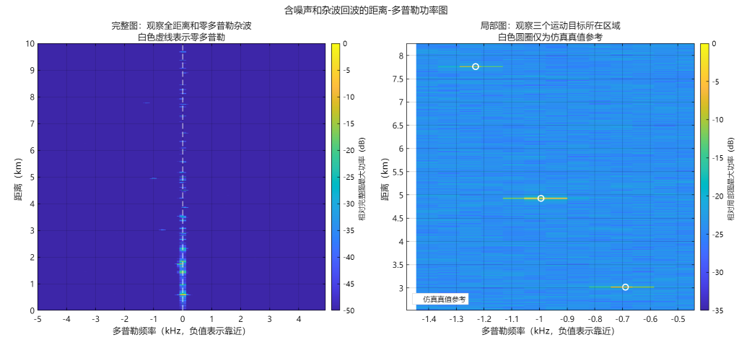

进行CA-CFAR检测
对每个CUT附近的参考单元进行求背景估计后，计算自适应门限T，这里就直接选取0dB作为门限，此时超过0dB的部分显示为黄色、红色和绿色,我们可以明显看见目标，右图对超过门限的部分进行二值化D_(i,j)={■(1,&P_(i,j)>T_(i,j)@0,&P_(i,j)≤T_(i,j) )┤，就是得到了最终目标的图，因此就找到了目标位置

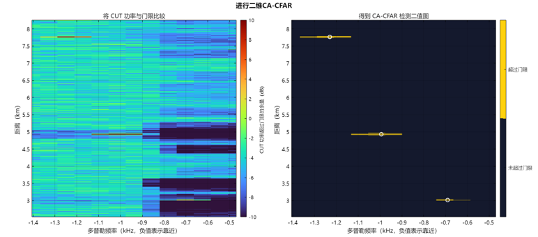